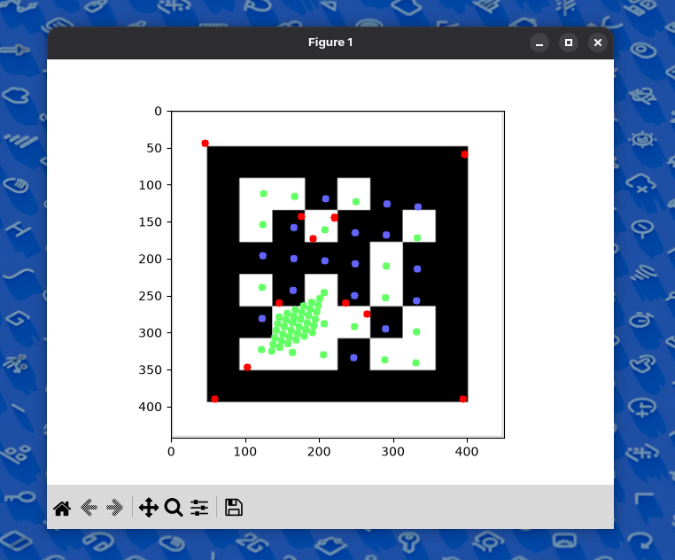

# Quadr



This is a april tag / qrcode reader package for python, used as a learning
project for c extensions. This project aims to be a somewhat high performance
reader and is paired with *numpy* and *opencv*.


# Installation

Currently, clone this repository or download a release if available, run `pip
install .`, and then follow the usage example.


# Usage

The basic usage is as follows.

```python
import fastqr

# Get an image variable
# image = something

# This context manager prevents manually calling of destroy_pipeline and
# create_pipeline.
with fastqr.AprilDetector(image.shape[1], image.shape[0]) as april:
    # Returns a list of detected and decoded tags
    tags = april.find_tags(image)
    print(tags)

# See main.py for example...
````


# Project Structure
```
src/fastqr, the main module
src/fastqr/quadr, quad detection library
src/fastqr/*.py, python utility libraries for decoding
```
